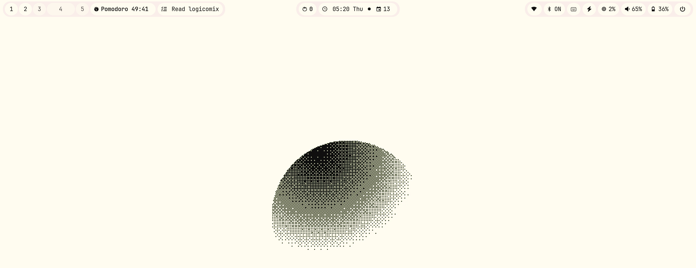

# omarchy-waybar

A Waybar module and companion scripts that display your Taskwarrior TODOs and GNOME Pomodoro state on the Waybar.

This project integrates with **Taskwarrior** (shows TODO list and active task) and **GNOME Pomodoro** (start/stop and show timer) so you can see and control your tasks and pomodoros straight from your Waybar.

---

## Key features

* Shows Taskwarrior TODO items directly in Waybar (quick glance for active tasks).
* Integrates with GNOME Pomodoro: a tomato icon shows the timer state and remaining time.
* **Double-clicking the tomato** starts a Pomodoro session (configurable behavior).
* When you mark a Taskwarrior task as **active**, it appears on the Waybar for quick context.
* Two built-in themes: **dark** and **light** (CSS files provided) so you can preview how the bar looks.
* Minimal dependencies — designed to be dropped into your `~/.config/waybar` setup and tweaked.

---

## Screenshots




## Quick start

> These are conservative instructions that work for most setups. The repository contains a `scripts/` folder and configuration files — copy or adapt those into your Waybar configuration.

1. Clone the repository:

```bash
git clone https://github.com/xnileshtiwari/omarchy-waybar.git
cd omarchy-waybar
```

2. Install prerequisites (examples):

* Waybar (your compositor package manager)
* Taskwarrior (`task` CLI)
* GNOME Pomodoro (or another pomodoro daemon with compatible controls)
* `bash` / `sh` (scripts are POSIX / shell), or Python if any helper scripts need it

Use your distribution's package manager, e.g. on Debian/Ubuntu:

```bash
sudo apt install waybar taskwarrior gnome-pomodoro
```

On Arch/Manjaro:

```bash
sudo pacman -S waybar task gnome-pomodoro
```

3. Copy (or symlink) provided module files into your Waybar config:

```bash
# back up your waybar config first
mkdir -p ~/.config/waybar/custom-modules
cp config.jsonc ~/.config/waybar/config.d/omarchy.jsonc
cp style.css ~/.config/waybar/style-omarchy.css
cp -r scripts ~/.config/waybar/omarchy-scripts
```

4. Add a module entry to your main Waybar config (example snippet):

```jsonc
// inside your existing ~/.config/waybar/config
"modules-left": [ "custom/omarchy" ],

"custom/omarchy": {
  "format": "{output}",
  "exec": "~/.config/waybar/omarchy-scripts/omarchy.sh",
  "interval": 1,
  "on-click": "~/.config/waybar/omarchy-scripts/on_click.sh",
  "return-type": "json"
}
```

> Adjust `exec`/`on-click` paths to match the script names in `scripts/`.

5. Make the scripts executable:

```bash
chmod +x ~/.config/waybar/omarchy-scripts/*.sh
```

6. Restart Waybar (or your session) to load the new module.

---

## Configuration notes

* `config.jsonc` contains a JSON-like configuration you can tune (poll intervals, which Taskwarrior fields to show, pomodoro behavior, icons, etc.).
* `style.css` contains two theme rules (dark & light). You can either copy the file content into your global Waybar CSS or keep it separate and import it.

### Themes

* To preview **dark** theme: include or import the `.dark` CSS section (or use the provided `style-omarchy.css` and toggle a `.dark` class in Waybar).
* To preview **light** theme: apply the `.light` class in the CSS or swap the CSS file.

(Exact CSS classes are in `style.css` in this repository.)

---

## How it works (overview)

* The module uses scripts in `scripts/` to read Taskwarrior tasks (via the `task` command) and to query/control GNOME Pomodoro (via available command-line or D-Bus interfaces).
* The Waybar module runs the main `exec` script on an interval; the script outputs JSON or plain text that Waybar renders.
* Double-click handling is implemented via Waybar's click interface: a double-click triggers a script/command that starts a Pomodoro session.
* Marking a task **active** in Taskwarrior (e.g. `task <id> start`) will be picked up by the script and shown on the bar.

---

## Usage examples

* Start a pomodoro by double-clicking the tomato icon on the bar.
* Mark a task active so it appears on the bar:

```bash
task 42 start
# or
task <UUID> start
```

* Complete a task from Taskwarrior and watch the bar update on the next polling interval:

```bash
task 42 done
```

---

## Troubleshooting

* If nothing appears in Waybar, verify the `exec` path is correct and the script prints output to stdout.
* Make sure `task` and `gnome-pomodoro` are installed and accessible from the environment where Waybar runs (Waybar inherits environment from the session).
* Logs: run the module script manually in a terminal to see errors, e.g.

```bash
~/.config/waybar/omarchy-scripts/omarchy.sh
```

---

## Contributing

Contributions, issues, and feature requests are welcome.

* Please open issues for bugs or feature ideas.
* If you submit a PR, include a short description and a screenshot demonstrating the change (add to `screenshots/`).

---

## Notes

* This README is intentionally generic to support a variety of Waybar setups. If the implementation in `scripts/` differs from what is described above, adjust the `exec` and `on-click` hooks to match the actual script names and interfaces present in this repository.
* There is a `scripts/` folder in this repository — inspect those scripts for exact file names and any additional dependencies.
